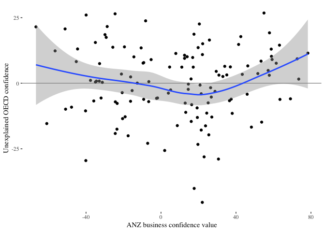

Confidence in Business Confidence
================

**File note**: The formatted (non-code) version of this document is README.md. To see the R code used to create the analysis, consult README.Rmd.

The problem
-----------

Sam Warburton, @economissive on Twitter, posed a question that in my words was "If we assume that the ANZ New Zealand Business Confidence survey responses are biased, and compensate for that bias, is there anything economically useful to be learned in the data". The reason for this question is that in other countries Business Confidence is a leading indicator for economic activity, giving forewarning of changes to G.D.P.

The answer is no, nothing economically is to be learned. ...ish. But for those that want the finer detail...

The Data
--------

For exploring the problem, I am gathering data from four sources:

-   ANZ business confidence results, obtained from the ANZ business outlook survey by asking ANZ for their historical Data, see <https://www.anz.co.nz/about-us/economic-markets-research/business-outlook/>

ANZ business confidence is the results of monthly (excluding January) business outlook survey, with individual sector business confidences and and overall figure. The overall figure generates the news headlines.

-   OECD business confidence sector results, which for New Zealand are based on an NZIER survey, obtained via the OECD through the OECD package for R, see <http://stats.oecd.org/Index.aspx?datasetcode=MEI_BTS_COS>

Some countries report differing numbers of sectors, and some countries report monthly, quarterly, or monthly and quarterly. To make the various series completely compatible, where a country has quarterly results I am using the mean result for all sectors of the quarter, and where a country does not have quarterly results I am using the mean result of all months for all sectors in that quarter

-   New Zealand GDP data, obtained via Infoshare at Stats NZ, see <http://archive.stats.govt.nz/infoshare/>

This data is Group: National Accounts - SNA 2008 - SNE, Table: Series, GDP(P), Chain volume, Actual, Total (Qrtly-Mar/Jun/Sep/Dec)

-   A hand constructed list of Prime Ministers of New Zealand, the Party they belonged to, and their gender. Obtained from Wikipedia <https://en.wikipedia.org/wiki/List_of_Prime_Ministers_of_New_Zealand>

The bias
--------

The general contention is that business confidence "should" be based on some kind of judgement about what is going to happen in economy- the confidence should involve foresight. This is why business confidence is described by the OECD as a leading indicator, providing insight about the next quarters economy.

This means that if I assume that business confidence should have been perfectly predictive, I know what the business confidence should have been for a given next quarter GDP value.

Where the confidence lines are not at the same point, ANZ confidence is over or under optimistic compared to the economy. To check if this difference in optimism is systematic, I checked the amount of over/under by New Zealand Prime Minister party and gender.

 Putting aside the entries with relatively few data points, business confidence is more optimistic than economic reality indicates around 70 percent of the time a Male leader of the National Party is Prime Minister, while business confidence is more pessimistic than economic reality indicates around 90 percent of the time a female leader of the Labour Party is Prime Minister. The difference of optimism (unjustified by economic conditions). There is around a 60 point optimism gap between the two that does not reflect the economy.

Business Confidence: ANZ & NZIER
--------------------------------

With two sources for business confidence, in talking about the subject we need to check the extent to which the raw numbers in the ANZ survey are in agreement with the normalised numbers in the OECD data. Checking the two confidence data sets against each other, they have Pearson's correlation coefficient of 0.89, which I would consider a strong match given the slightly different time periods.

Building a basic linear model of the 94 comparison quarters common to both surveys, a examining the degree of over or under confidence in the OECD data relative to the ANZ data (the residuals) given the ranges of both surveys, it is possible that the OECD data tends more optimistic than the ANZ when the ANZ data is at extremes. However, as a flat "no trend here" line at 0 fits within the uncertainty of the trend of the residuals, I am comfortable treating the two data sources as equivalent.

Because the two sources are equivalent, I feel that justified that what I am exploring is a general business confidence issue rather than a specific ANZ survey methodology issue.

A baseline model
----------------

To know if accounting for bias improves the economic usefulness of the business confidence survey, I created a baseline prediction model in which includes the

In doing so, I explored several different treatments of how to match individual months to quarterly GDP and what predict GDP change gets measured as, then picked the best fitting model. This overfits the data, creating what appears to be a much more effective model than it really is, that would result in declining prediction rate on new data. I am, however, deliberately doing this as it seems to match standard practice.

The most optimistic model gives a correlation of 0.2 between the ANZ business confidence and change in next quarters GDP.

Business confidence as a dependent variable
-------------------------------------------

Instead of taking Business Confidence as an independent variable measuring GDP, I can treat it as a dependent variable at least in part generated by the opinions of CEOs about the political party in government, the gender of the Prime Minister, and how long the government has been in office.

    ## 
    ## Call:
    ## lm(formula = anzconf ~ PMparty * PMgender * Term_month, data = bc_pols)
    ## 
    ## Residuals:
    ##     Min      1Q  Median      3Q     Max 
    ## -76.289 -15.505  -0.871  17.220  57.475 
    ## 
    ## Coefficients:
    ##                                           Estimate Std. Error t value
    ## (Intercept)                              -10.21550    4.05959  -2.516
    ## PMpartyNational                         -171.32417   75.75741  -2.261
    ## PMgenderMale                             -48.37880   29.23727  -1.655
    ## Term_month                                -0.25089    0.06967  -3.601
    ## PMpartyNational:PMgenderMale             265.48502   81.18710   3.270
    ## PMpartyNational:Term_month                 2.31141    0.77390   2.987
    ## PMgenderMale:Term_month                    1.34636    0.48593   2.771
    ## PMpartyNational:PMgenderMale:Term_month   -3.56618    0.91346  -3.904
    ##                                         Pr(>|t|)    
    ## (Intercept)                             0.012320 *  
    ## PMpartyNational                         0.024366 *  
    ## PMgenderMale                            0.098917 .  
    ## Term_month                              0.000365 ***
    ## PMpartyNational:PMgenderMale            0.001186 ** 
    ## PMpartyNational:Term_month              0.003026 ** 
    ## PMgenderMale:Term_month                 0.005904 ** 
    ## PMpartyNational:PMgenderMale:Term_month 0.000114 ***
    ## ---
    ## Signif. codes:  0 '***' 0.001 '**' 0.01 '*' 0.05 '.' 0.1 ' ' 1
    ## 
    ## Residual standard error: 24.78 on 337 degrees of freedom
    ## Multiple R-squared:  0.4889, Adjusted R-squared:  0.4783 
    ## F-statistic: 46.06 on 7 and 337 DF,  p-value: < 2.2e-16

With an adjusted R-squared of 0.48 the interactions between Party, gender of Prime Minister, and length of time in office explain about half of the business confidence values.

When making a model, it is good practice to explore the unexplained variation in the model (the residuals). In this case the unexplained variation is business confidence not explained by those three variables contrasted to the distribution of explained (fitted) values.

Interpreting the graph, where the residuals (orange) are at 0 on the graph is the range in which the model best matches survey results. For Male National Prime Ministers this is when business confidence is around +20 to +40. For Female Labour Prime Ministers this is around -10 to -40. As a consequence, a 30 to 80 point difference in business confidence between the two, without any affect of economic conditions, is not unusual.

The model is currently doing a poor job of handling values at the fringes of the subgroups (where the centre of the subgroup is being treated as the residual 0 region). As Male Labour Prime Ministers and Female National Prime Ministers are in the middle of the range, the model is balanced in optimism, while for Female Labour Prime Ministers the model is pessimistic with respect to middle of the total range (which is the high end for the subgroup). For Male National Prime Ministers the inverse is true, with the model overly optimistic if values move down towards the overall centre of the distribution.

From this I would expect that an improved model could be made, with better handling of the fringe values, so the current adjusted r-squared value of 0.48 can be seen as a lower bound of the strength of the relationship in which CEOs opinions about gender and party influence business confidence.

Can anything be salvaged
------------------------

I am now at the point of address the original question- with a model of how biased the respondents are, if you exclude the bias, can you learn anything economically useful.

The short answer is not really but sorta. If you take "best of all tested models" from earlier, and run it only the amount of business confidence not explained by the bias model (the residuals of the model), the non-bias confidence correlates only mildly better to GDP than the business confidence containing bias. A correlation of 0.29 is still not really high enough to be useful as a predictor.

But the usefulness of business confidence has increased as a potential predictor, suggesting that the principle is sound but either the bias model is not good enough, or the economic indicators are too weak, or both. There seems to be the opportunity to improve the accuracy of the model, but even if it was possible, then it would be making predictions on top of a overspecialised model. The root problem is not with technical skills needed to derive some economic insight despite the data, it is that the major influences on business confidence are totally unconnected to the economy.
